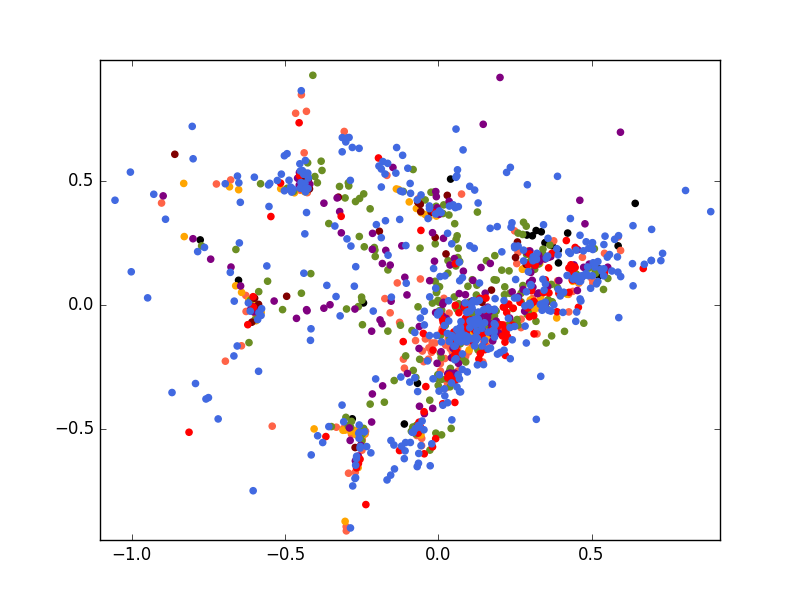
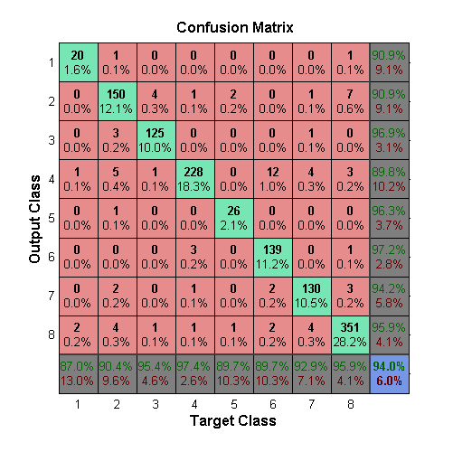

# Musical Instrument Recognition System using Artificial Neural Networks


## Authors

* [Babak Toghiani-Rizi](https://github.com/babaktr)
* [Marcus Windmark](https://github.com/windmark)

Paper available [here](https://arxiv.org/abs/1705.04971).


## Introduction

In this project, Artificial Neural Networks were trained to classify a range of musical instruments and a number of comparative experiments were conducted on how much different characteristics of the musical instruments would impact the resulting accuracy. These experiments were, using:

* The whole sample
* The attack of the sound
* Everything but the attack of the sound
* The initial 100 Hz of the frequency spectrum
* The following 900 Hz of the frequency spectrum

## Dataset


The dataset used in this project was the [London Philharmonic Orchestra Dataset](http://www.philharmonia.co.uk/explore/make_music), consisting of recorded samples from 20 different musical instruments. For each instrument, the samples range over its entire set of tones played in every octave with different levels of strength (piano, forte) and length. In addition to that, the dataset also includes samples where different playing techniques are used with the instrument, such as _vibrato_, _tremolo_, _pizzicato_ and _ponticello_.

In order to limit the scope of this project, the following eight instruments were selected to train the model: Banjo, Cello, Clarinet, English horn, Guitar, Oboe, Trumpet and Violin. This set of instruments was chosen because of the high quality of the samples and them ranging over the three instrument families Brass, String and Woodwind. 

To avoid handling potential different harmonics in the same tone across the octaves, only the samples of recordings done in the fourth octave were used.

| Index 	| Instruments 	| Samples |
| :---:	| :----------: 	| :-----:	|
| 1			| Banjo			| 23 		|
| 2  		| Cello 			| 166 		|
| 3			| Clarinet		| 131		|
| 4 		| English Horn	| 234 		|
| 5			| Guitar			| 29		|
| 6			| Oboe				| 155		|
| 7			| Trumpet			| 140		|
| 8			| Violin			| 366		|

## Training
The model used for training was a Multilayer Perceptron with Early Stopping, using Resilient Back Propagation as the learning heuristic. The network consisted of:

* 50 inputs
* 30 hidden nodes
* One output node (with eight different outputs, one for each instrument)

## Results

The following table displays the results of the training, run over an average of 10 sessions.

| Experiment			| Accuracy 		|
| :------------:		| :-----------: 	|
| Base experiment	| 93.5%			|
| Only Attack			| 80.2%			|
| Without Attack		| 73.2%			|
| First 100 Hz		| 64.2%			|
| Following 900 Hz	| 90.6%			|

Below is a confusion Matrix from one of the training sessions, displaying an example of the accuracy for each class:



## Getting started
To get started, simply run ```neural_network.m``` in MATLAB.
There, you can also select which dataset to train the network with by uncommenting the following:

```MATLAB
load 'datasets/<dataset>.mat'
```

The available processed datasets are:

| Dataset				| Filename 		|
| :------------:		| :-------------: 	|
| Base experiment	| ```1-dataset_avgvalue_chunk50.mat``` |
| Only Attack			| ```2-dataset_avgvalue_chunk50_only_attack.mat``` |
| Without Attack		| ```3-dataset_avgvalue_chunk50_without_attack.mat``` |
| First 100 Hz		| ```4-dataset_avgvalue_chunk50_100hz.mat``` |
| Following 900 Hz	| ```5-dataset_avgvalue_chunk50_900hz.mat``` |
